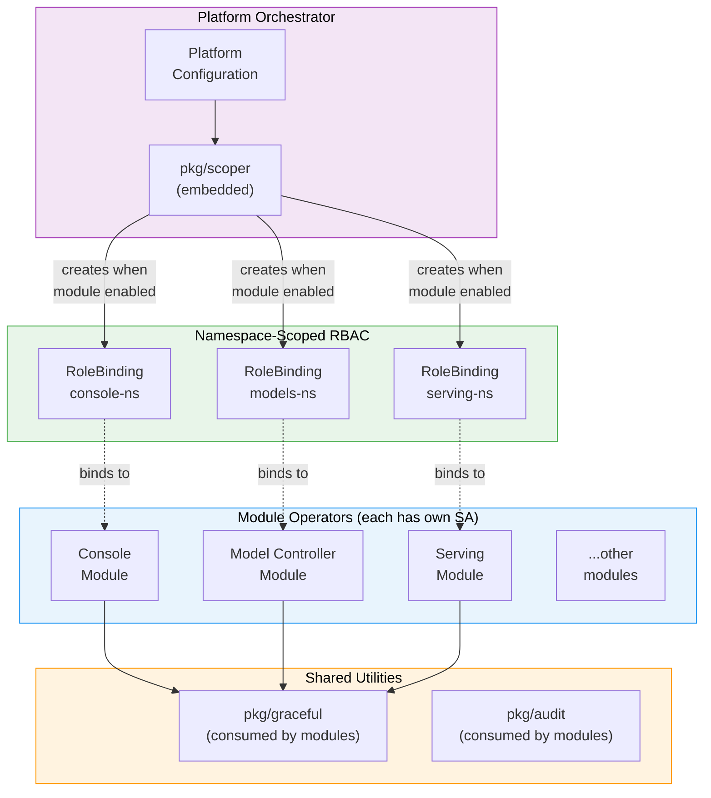

# Modularization Alignment

How the Operator RBAC Toolkit maps to modular operator architectures.

## Central Orchestrator Pattern

Modular operator architectures converge on a central orchestrator that manages RBAC for individual module operators. This is not a novel pattern. It appears independently across the ecosystem:

| Project | Orchestrator | RBAC Mechanism |
|---------|-------------|----------------|
| [Crossplane RBAC Manager](https://github.com/crossplane/crossplane/blob/main/design/design-doc-rbac-manager.md) | Dedicated RBAC controller | Holds `escalate` + `bind`, dynamically creates per-provider ClusterRoles and Bindings |
| [OLM OperatorGroups](https://github.com/operator-framework/operator-lifecycle-manager/blob/master/doc/design/scoped-operator-install.md) | OLM controller | Creates scoped RoleBindings per OperatorGroup namespace |
| [Cluster API Operator](https://github.com/kubernetes-sigs/cluster-api-operator/blob/main/docs/README.md) | CAPI Operator | Manages RBAC for infrastructure providers it installs |
| **Platform Operator + pkg/scoper** | Embedded scoping controller | Holds `bind` only, creates per-module RoleBindings dynamically |

A platform operator that already serves as the central orchestrator (reconciling platform configuration and managing module lifecycle) can embed `pkg/scoper` to add RBAC scoping to that existing role without introducing a new component.

### Crossplane: Closest Precedent

Crossplane's [RBAC Manager design](https://github.com/crossplane/crossplane/blob/main/design/design-doc-rbac-manager.md) is the closest precedent to this toolkit's approach:

- A dedicated component holds the elevated RBAC verbs (`escalate`, `bind`)
- Provider operators never touch RBAC
- The RBAC manager dynamically creates per-provider Roles and Bindings as providers are installed or removed

The key difference: Crossplane's RBAC manager requires both `escalate` and `bind`. The toolkit's scoping controller requires only `bind` (it references pre-existing static ClusterRoles, never creating new permission sets). This is a smaller privilege surface.

## Mapping to Modular Architecture

In a modular architecture, each component module (Console, Model Controller, Serving, etc.) runs as an independent operator with its own ServiceAccount. The central orchestrator manages which modules are enabled and their configuration.

### Per-Module ServiceAccounts and Selective Enablement

Each module operator gets its own ServiceAccount. The scoping library creates per-module RoleBindings dynamically as modules are enabled or disabled through the platform configuration:

- **Module enabled**: The scoping controller detects the module CR (or platform config field) and creates namespace-scoped RoleBindings for that module's SA in the namespaces it needs.
- **Module disabled**: The scoping controller detects the CR deletion and garbage-collects the RoleBindings (via OwnerReference for same-namespace, annotation-based cleanup for cross-namespace).

This means a disabled module has zero RBAC footprint. No RoleBindings exist for modules that aren't active. The blast radius of a compromised SA token is limited to the namespaces where that specific module is deployed.

### Shared Utilities Framework Mapping

The modularization architecture defines a "Shared Utilities Framework" consumed by module operators. The toolkit's packages map directly to this concept:

| Shared Utility | Toolkit Package | Consumer | Purpose |
|---------------|----------------|----------|---------|
| Permission handling | `pkg/graceful` | Module operators | Wrap K8s API calls with structured degradation, status conditions, and retry logic |
| Permission auditing | `pkg/audit` | Module operators, CI pipelines | Detect permission drift, unused rules, over-granted verbs |
| RBAC scoping | `pkg/scoper` | Orchestrator only | Create per-module, per-namespace RoleBindings based on platform configuration |

The placement matters: `pkg/scoper` is embedded in the orchestrator (admin trust domain), while `pkg/graceful` and `pkg/audit` are consumed by module operators (operator trust domain). This maintains the trust domain separation described in the [Architecture Overview](overview.md).

## Status Condition Alignment

The modularization architecture standardizes status conditions across modules:

| Modularization Condition | Toolkit Equivalent | Source |
|--------------------------|-------------------|--------|
| `Ready` | `PermissionGranted` | `pkg/graceful` sets this when all required permissions are verified |
| `Degraded` | `Degraded` (with RBAC reason) | `pkg/graceful` sets this when permissions are missing, includes the specific missing permission in the message |

When modules are controller-runtime operators, `pkg/graceful` is directly applicable. Each module's reconciler wraps its K8s API calls with `handler.Do()`, and the status conditions propagate naturally to the platform's aggregated status.

For modules that are not yet controller-runtime operators (e.g., a web console with a TypeScript/Go BFF architecture), the existing HTTP error handling covers the same functional need.

## Applicability by Architecture Stage

| Architecture | Module Architecture | Scoper Applicable | Graceful Applicable |
|--------------|--------------------|--------------------|---------------------|
| Monolithic | Single operator, shared SA | Yes (scopes existing SA) | Limited (non-controller-runtime backends) |
| Modular | Independent operators, per-module SAs | Yes (per-module scoping) | Yes (controller-runtime modules) |

The toolkit is useful today for scoping an existing shared SA. It becomes more powerful in a modularized architecture where each module has an independent SA and the orchestrator coordinates RBAC across all of them.

## References

- [Crossplane RBAC Manager Design](https://github.com/crossplane/crossplane/blob/main/design/design-doc-rbac-manager.md)
- [OLM Scoped Operator Installs](https://github.com/operator-framework/operator-lifecycle-manager/blob/master/doc/design/scoped-operator-install.md)
- [CNCF Operator White Paper](https://tag-app-delivery.cncf.io/whitepapers/operator/)
- [Kubernetes RBAC Good Practices](https://kubernetes.io/docs/concepts/security/rbac-good-practices/)
- [Cluster API Operator](https://github.com/kubernetes-sigs/cluster-api-operator/blob/main/docs/README.md)
