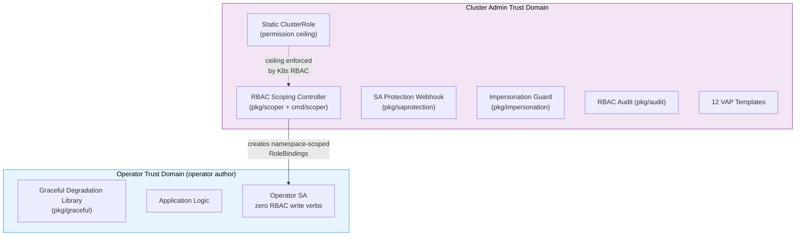

# Architecture Overview

## Problem Analysis

### Root Cause

Kubernetes operators routinely ship with overly broad ClusterRole permissions. The [CNCF Operator White Paper](https://www.cncf.io/blog/2022/06/15/kubernetes-operators-best-practices/) confirms that operator build kits such as the Operator SDK "use general RBAC defaults that developers may have not refined for their specific operator." In practice, operators are deployed with cluster-wide access to secrets, configmaps, and other sensitive resources across all namespaces, even when they only need access in the namespaces where their Custom Resources exist.

Three systemic patterns cause this:

1. **Permissions added erroneously.** Developers assume the ServiceAccount needs permissions that are actually accessed via user-token passthrough. The permission is granted but never exercised by the SA.
2. **Permission drift.** Features are removed or refactored, but the corresponding RBAC rules remain in the ClusterRole. Nobody audits the gap.
3. **Over-granted verbs.** Rules specify `[get, list, watch, create, update, patch, delete]` when only `[list]` is needed. Scaffolding tools generate broad defaults and developers don't refine them.

### Real-World Audit: Web Console Operator

A real-world audit of a production web console operator's ClusterRole found that only **2 out of 30 rules** were correctly scoped:

- **9 rules** were entirely unused
- **14 rules** were over-permissioned
- The `watch` verb was granted on nearly every resource despite never being used (the backend polls with interval-based `list` calls, not the Kubernetes watch API)

### Why Standard RBAC Does Not Solve This

Kubernetes RBAC provides the primitives to enforce least privilege, but it does not automate their application. The gap is operational, not technical:

- **ClusterRoleBindings are the default.** When an operator needs cross-namespace access (e.g., to a notebooks namespace and a model registry namespace), developers grant a ClusterRoleBinding rather than creating per-namespace RoleBindings. The ClusterRoleBinding grants access everywhere.
- **Namespace locations are dynamic.** Components like workload runners or model registries can be deployed to admin-configurable namespaces. Static RBAC manifests cannot target namespaces that are determined at runtime.
- **Nobody scopes after deployment.** Cluster admins install operators via OLM, Helm, or GitOps. The operator ships with a ClusterRole and ClusterRoleBinding. Nobody goes back to create namespace-scoped alternatives.

### Impact Assessment

When an operator's ServiceAccount token is compromised (via pod escape, supply chain attack, or token exfiltration), the blast radius is determined by the RBAC permissions granted to that SA.

| Vector | With ClusterRoleBinding | With Namespace-Scoped RoleBindings |
|--------|------------------------|------------------------------------|
| **Secret access** | All secrets in all namespaces (e.g., 43 secrets in kube-system alone) | Only secrets in namespaces with active CRs (e.g., 5 secrets in one namespace) |
| **Lateral movement** | Token can access resources in any namespace, enabling pivot to other workloads | Access is confined to CR-bearing namespaces |
| **Privilege escalation** | Broad verb grants (create, patch, delete) across cluster enable multiple escalation paths | Reduced verb surface in fewer namespaces limits escalation options |

### Attack Scenarios

**Secret exfiltration.** An attacker gains access to the operator's SA token (e.g., through a container escape in a co-located workload). With a ClusterRoleBinding granting `list` on secrets, the token can enumerate secrets in every namespace, including kube-system (cloud provider credentials, TLS certificates, database passwords). With namespace-scoped RoleBindings, the same token is rejected with `Forbidden` for every namespace except those with active CRs.

**Impersonation bypass.** The default `system:aggregate-to-edit` ClusterRole includes the `impersonate` verb for ServiceAccounts. Any user with namespace `edit` permissions can impersonate the operator's ServiceAccount and inherit its full ClusterRole permissions. This bypasses all RBAC restrictions on the user, turning a namespace-scoped editor into a cluster-wide privileged actor.

**Unused permission exploitation.** An operator's ClusterRole grants `create` on `clusterrolebindings` even though no code ever calls that API. An attacker with access to the SA token can use this unused permission to create a ClusterRoleBinding granting `cluster-admin` to an attacker-controlled ServiceAccount.

### Previous Approach Limitations (v1)

The predecessor project (operator-security-runtime v1) addressed this problem by having operators manage their own RBAC at runtime. The operator created namespace-scoped Roles and RoleBindings tied to the CR lifecycle, using OwnerReferences for garbage collection.

This approach worked but conflated two distinct concerns:

1. **Operator-side concern.** "I need to handle the case where I don't have permissions."
2. **Admin-side concern.** "I need to scope what permissions this operator has."

By having the operator do both, the architecture had structural problems:

- **Self-modifying RBAC.** The operator needed the `escalate` verb (or `bind` verb) to manage its own permissions. A compromised SA could modify its own Roles, violating least privilege. The CNCF, NSA/CISA, and Kubernetes upstream documentation all warn against this pattern.
- **Broken trust boundary.** The producer and consumer of RBAC were the same entity. There was no independent authority validating or constraining the operator's permission grants.
- **Complexity burden on operator authors.** Operator authors had to understand RBAC lifecycle management, drift recovery, and garbage collection. These are responsibilities that belong to the platform layer, not the application layer.

Community feedback, including from former Operator-SDK and OLM contributors, consistently reinforced this: "Let the operator worry about attempting to do the tasks it was meant to do and design it to gracefully fail on permission errors. Let the owners/managers of the cluster be responsible for managing permissions."

---

## Design Principles

### 1. Trust Domain Separation

The RBAC management authority should be a separate entity from the operators it manages, with a separate ServiceAccount. Compromising an operator should not compromise RBAC management. This is the core architectural change from v1. The standalone controller deployment achieves full separation. The embedded library deployment trades some separation for deployment convenience.

### 2. Operators Are RBAC Consumers, Not Producers

Operator-side components (the operator itself and the graceful degradation library) should never create, modify, or delete Roles, ClusterRoles, RoleBindings, or ClusterRoleBindings. They should not require the `escalate`, `bind`, or any RBAC write verbs. Operators consume permissions granted by external authorities. Admin-side components (the scoping controller, impersonation guard) operate in the admin trust domain and may manage RBAC resources as part of their designated function.

### 3. Graceful Degradation Over Fail-Fast

When an operator lacks permissions, it should degrade gracefully rather than crash. This means surfacing structured status conditions, emitting events, and retrying when permissions change. This is the pattern established by ArgoCD's `resource.respectRBAC` feature, generalized into a reusable library.

### 4. Cluster Admin Owns the Policy

The cluster administrator decides what permissions an operator receives. The tooling should make this easy (scoping controller, VAP templates, audit reports) but never override admin decisions. The admin can choose to deploy the scoping controller, manage RBAC through GitOps, or use OLM OperatorGroups. All paths are valid.

### 5. Defense in Depth

No single mechanism is sufficient. The toolkit provides independent, complementary layers that each reduce risk. Each layer can be deployed independently. The combination provides coverage that no individual mechanism achieves alone.

### 6. Zero Friction for Operator Authors

The graceful degradation library requires zero RBAC verbs, no webhooks, no CRDs, and no additional deployment dependencies. Operator authors `go get` the package and wire it into their reconciler. The admin-side components (scoping controller, VAPs, audit) are separate concerns with separate deployment paths.

---

## Solution Architecture

### Component Overview

The toolkit is split into three independent components, each with a clear owner:

### Component Interaction Model

The three components are independent. They do not require each other to function:

- An operator can use the graceful degradation library without the scoping controller being deployed.
- The scoping controller can manage RBAC for operators that don't use the graceful degradation library.
- The defense-in-depth toolkit can be deployed without either of the other components.

When all three are deployed together, they provide complementary coverage:

1. The **scoping controller** ensures the operator only has permissions in namespaces with active CRs.
2. The **graceful degradation library** ensures the operator handles missing permissions cleanly during transitions (CR creation before RoleBinding provisioning, admin RBAC changes mid-reconcile).
3. The **defense-in-depth toolkit** provides additional protection layers (SA identity protection, impersonation hardening, permission auditing).

**Asymmetry note.** The graceful degradation library detects under-grants (operator lacks permissions it needs) but not over-grants (operator retains permissions it should no longer have, e.g., orphan RoleBindings during cross-namespace cleanup latency). Over-grant detection is the scoping controller's responsibility via its garbage collection mechanisms.

### Alternatives Considered

| Approach | Pros | Cons | Decision |
|----------|------|------|----------|
| Operator self-manages RBAC (v1) | Zero-friction deployment, single binary | Violates trust domain separation, requires escalate/bind verbs, community consensus against it | Rejected as primary model. Redesigned into separated components. |
| Pure admission policies (VAPs/OPA) | No RBAC manipulation, uses existing K8s primitives | Admission policies do not intercept GET/LIST/WATCH requests. Cannot restrict read access. | Used as defense-in-depth complement, not primary mechanism. |
| Authorization with Selectors (KEP-4601) | Works at authorization layer, intercepts all operations including reads | Adds latency to every API call, requires K8s 1.31+ (alpha), complex to implement | Future direction, not current dependency. See [KEP-4601](https://github.com/kubernetes/enhancements/issues/4601). |
| Kubectl plugin for static RBAC generation | Zero runtime components, admin-controlled | Does not dynamically adjust as CRs are created/deleted | Complementary tool, not primary mechanism. |
| OLM OperatorGroups with scoped SAs | Upstream-supported, admin-controlled | Only works with OLM-managed operators, does not handle dynamic namespace scoping | Supported as an alternative deployment model. |

### Coexistence with OLM and Helm RBAC

The scoping controller can coexist with OLM OperatorGroups and Helm-managed RBAC:

- **OLM OperatorGroups.** OLM creates RoleBindings for operators based on OperatorGroup configuration. The scoping controller creates independently-named RoleBindings (`<name>-scoped-binding`). Both can coexist, as they manage different RoleBinding resources for the same SA. During migration, the OLM-managed bindings can be removed after the scoping controller is verified.
- **Helm RBAC.** Helm charts with `rbac.create: true` create static RBAC resources. The scoping controller's RoleBindings are additive. Set `rbac.create: false` in the Helm chart after migrating to scoped bindings if the chart's ClusterRoleBinding is the resource being replaced.
