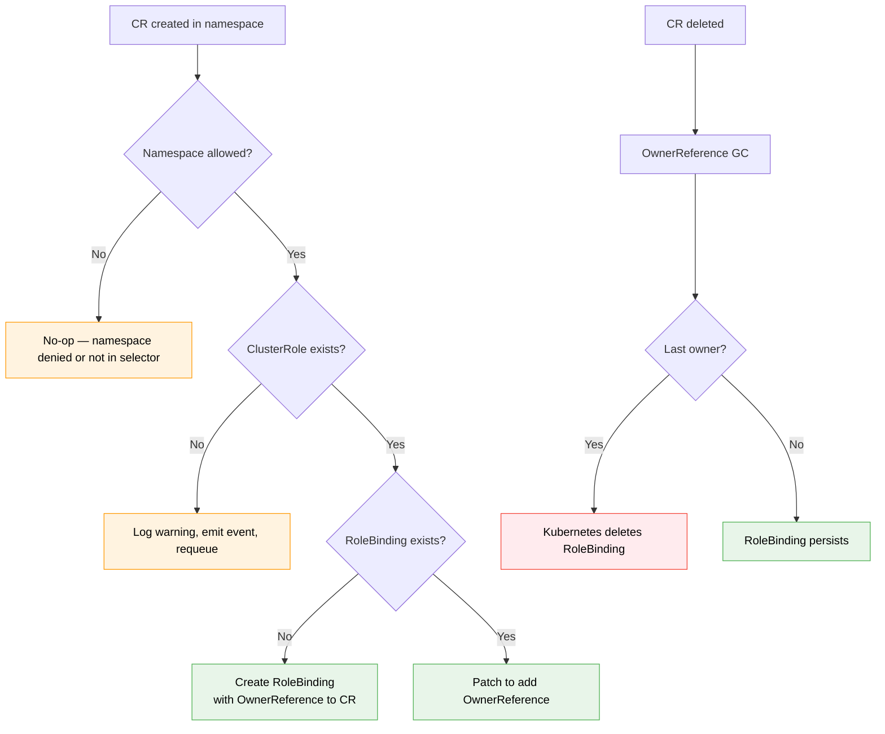

# RBAC Scoping Controller

## Purpose

The RBAC Scoping Controller (`pkg/scoper`) is an admin-side component that dynamically manages namespace-scoped RoleBindings for target operator ServiceAccounts. When a Custom Resource appears in a namespace, the controller creates a RoleBinding granting the operator's SA access in that namespace. When the CR is deleted, the RoleBinding is cleaned up.

The controller runs with its own ServiceAccount, separate from the operators it manages. This is the core trust domain separation: compromising an operator's SA does not compromise RBAC management.

---

## Delivery Options

The scoping controller is available as:

1. **Standalone binary** (`cmd/scoper`). Cluster admins deploy it as a separate Deployment with leader election enabled (recommended: 2 replicas). Suitable for clusters without an existing platform operator.
2. **Importable Go package** (`pkg/scoper`). Platform operators (e.g., the RHOAI operator, which already reconciles DSC/DSCI) embed the scoping logic into their existing reconciliation loop. Zero additional deployment friction. The embedded library inherits the host operator's leader election and HA configuration.

Both options use the same `pkg/scoper` library. The standalone binary is a thin wrapper that reads configuration from a ConfigMap and starts the controller.

**Security note on embedded mode.** When the scoping controller is embedded in a platform operator, it shares that operator's ServiceAccount. This collapses the trust domain separation. The embedded mode trades trust domain separation for deployment convenience. Use the standalone binary when full trust domain separation is required.

---

## How It Works

### Configuration

The controller is configured with a list of scoping targets. Each `ScopingTarget` specifies:

| Field | Description |
|-------|-------------|
| `WatchGVK` | The GVK of the Custom Resource to watch. When a CR of this GVK appears in a namespace, a RoleBinding is created. |
| `TargetSA` | The ServiceAccount to grant access to. |
| `ClusterRoleName` | The ClusterRole to reference in the RoleBinding. Must be pre-deployed by the admin and must not use `aggregationRule`. |
| `ManagedRoleBindingName` | The name to use for managed RoleBindings. Deterministic naming enables drift detection and cleanup. |
| `NamespaceSelector` | (Optional) Restrict which namespaces are watched. If nil, all namespaces are watched. Required for multi-tenant clusters. |
| `TargetNamespaceSource` | (Optional) Create the RoleBinding in a different namespace than the CR. The target namespace is read from the specified field in the CR. **Warning:** this field value is untrusted input. The controller validates it against NamespaceSelector and the deny-list before creating RoleBindings. |

For the standalone binary, this configuration is provided via a YAML file (typically mounted from a ConfigMap). The controller reads the file at startup via `--config` (default: `/etc/rbac-scoper/config.yaml`) and **requires a restart** to pick up changes. Hot-reload is not supported to avoid complexity in a security-critical component.

### CR Lifecycle Flow



```
CR Created in namespace "foo"
    |
    v
Controller detects CR via watch
    |
    v
Does namespace "foo" match NamespaceSelector? (if configured)
    |
    +-- No --> No-op (namespace not in scope)
    +-- Yes (or no selector configured) -->
        |
        v
    Does the referenced ClusterRole exist?
        |
        +-- No --> Log warning, emit event, requeue
        +-- Yes -->
            |
            v
        Does RoleBinding "<name>-scoped-binding" exist in "foo"?
            |
            +-- No --> Create RoleBinding referencing static ClusterRole
            |          with OwnerReference pointing to the CR
            |
            +-- Yes --> Check if OwnerReference for this CR exists
                            |
                            +-- No --> Patch to add OwnerReference
                            +-- Yes --> No-op (DeepEqual skip)

CR Deleted in namespace "foo"
    |
    v
OwnerReference GC removes the CR from the RoleBinding's OwnerReferences
    |
    v
Are there remaining OwnerReferences?
    |
    +-- Yes --> RoleBinding persists (other CRs still need it)
    +-- No --> Kubernetes GC deletes the RoleBinding
```

### Multi-CR Ownership

Multiple CRs of the same or different GVKs can exist in the same namespace. The controller uses Kubernetes OwnerReferences to track which CRs require the RoleBinding. The RoleBinding is only deleted when no CRs remain in the namespace. OwnerReference updates use `patch` (strategic merge patch) to avoid conflicts with concurrent modifications.

### Cross-Namespace Grants

When an operator needs access to a namespace different from where its CR exists (e.g., the Dashboard CR is in `redhat-ods-applications` but needs access to `rhods-notebooks`), the controller supports cross-namespace targets via `TargetNamespaceSource`.

For cross-namespace RoleBindings, OwnerReferences cannot be used (Kubernetes does not allow cross-namespace OwnerReferences). The controller uses **annotation-based ownership** instead:

- **Annotation key:** `operator-rbac-toolkit.io/scoped-access-owners`
- **Annotation value:** comma-separated list of `namespace/name/uid` entries
- **Size budget:** Kubernetes limits total annotation size to 256KB. At ~60 bytes per entry, this supports thousands of owner entries, well beyond any realistic scenario.
- **Concurrent updates:** handled via optimistic concurrency with retry-on-conflict (standard controller-runtime pattern)
- **Malformed entries:** skipped during parsing, not fatal. A warning is logged for each skipped entry.

### Cross-Namespace Input Validation

The `TargetNamespaceSource` field reads a namespace name from a CR field. This is untrusted input: a user who can create or modify the CR can set this field to any namespace (e.g., `kube-system`). The controller validates the target namespace before creating a RoleBinding:

1. **Deny-list check.** The target namespace is checked against a built-in deny-list. The default deny-list includes specific namespaces (`kube-system`, `kube-public`, `kube-node-lease`, `default`) and prefix patterns (`openshift-*` for OpenShift clusters). The deny-list also includes the scoping controller's own namespace. The deny-list is configurable to add platform-specific entries. This is enforced in the controller itself, independent of VAPs.
2. **NamespaceSelector check.** If a `NamespaceSelector` is configured on the target, the target namespace must match it.
3. **VAP enforcement.** The `deny-rolebinding-in-protected-namespaces` and `allow-rolebinding-in-labeled-namespaces` VAPs provide API-server-enforced validation as defense-in-depth.

---

## Static ClusterRole Requirement

The scoping controller uses **bind mode only**. It creates RoleBindings that reference a pre-deployed static ClusterRole. It never creates or modifies Roles or ClusterRoles.

The static ClusterRole defines the permission ceiling. It must be deployed by the cluster admin as part of the operator's installation manifests (Helm chart, OLM CSV, Kustomize, or GitOps).

Requirements for the static ClusterRole:

1. **Must not use `aggregationRule`.** If the ClusterRole uses aggregation, an attacker could inject additional rules by creating a ClusterRole with labels matching the aggregation selector, bypassing the static permission ceiling without modifying the ClusterRole directly. The scoping controller validates this at startup and refuses to reference an aggregated ClusterRole.
2. **Should be protected by the `protect-static-clusterrole` VAP** to prevent runtime modification.

```yaml
apiVersion: rbac.authorization.k8s.io/v1
kind: ClusterRole
metadata:
  name: odh-dashboard-scoped
  # No aggregationRule field
rules:
  - apiGroups: [""]
    resources: ["secrets"]
    verbs: ["get", "create", "update"]
  - apiGroups: [""]
    resources: ["configmaps"]
    verbs: ["get", "create", "update"]
  - apiGroups: [""]
    resources: ["persistentvolumeclaims"]
    verbs: ["create", "get"]
```

The permission ceiling is enforced by Kubernetes RBAC itself (the static ClusterRole is not modifiable by the operator or the scoping controller). A compromised operator SA can only use permissions defined in this ClusterRole, and only in namespaces where RoleBindings exist.

---

## RBAC Requirements

The scoping controller's ServiceAccount needs the following permissions:

| Permission | Purpose |
|------------|---------|
| `get`, `list`, `watch` on target CRDs | Detecting CR creation and deletion |
| `get`, `list`, `watch`, `create`, `update`, `patch`, `delete` on `rolebindings` | Managing namespace-scoped RoleBindings (list/watch for cleanup and drift detection, patch for OwnerReference updates) |
| `bind` on the static ClusterRole (via `resourceNames`) | Creating RoleBindings that reference the static ClusterRole |
| `get` on `clusterroles` (via `resourceNames`) | Startup validation of static ClusterRole (no aggregationRule) |
| `get`, `list`, `watch` on `namespaces` | Namespace label watching (required when `NamespaceSelector` is configured) |

The `bind` verb is scoped to specific ClusterRole names via `resourceNames`, preventing the controller from binding arbitrary ClusterRoles.

The controller does **not** need:

- `escalate` verb
- `create`, `update`, or `delete` on `roles` or `clusterroles`
- Any permissions on secrets, configmaps, or other application resources

---

## Drift Recovery and Garbage Collection

### Drift Recovery

If a managed RoleBinding is deleted externally (by an admin, a GitOps tool, or a misconfigured cleanup process), the controller detects the absence on the next reconciliation cycle and recreates it. This is standard controller-runtime reconciliation behavior.

If a managed RoleBinding is modified externally (e.g., the ClusterRole reference is changed), the controller detects the drift via DeepEqual comparison and corrects it.

### Same-Namespace GC (OwnerReferences)

For CRs in the same namespace as the RoleBinding, Kubernetes OwnerReference garbage collection handles cleanup automatically. When the last CR with an OwnerReference on the RoleBinding is deleted, the RoleBinding is garbage collected.

### Cross-Namespace GC (Annotation Cleanup)

For cross-namespace RoleBindings (where the RoleBinding is in a different namespace than the CR), annotation-based ownership is used. The controller runs a cleanup reconciler that:

1. Lists all managed RoleBindings (identified by the deterministic name).
2. For each RoleBinding, parses the owner annotations.
3. For each owner entry, checks if the referenced CR still exists, if the CR's GVK matches a configured scoping target, and (for `TargetNamespaceSource` targets) if the CR's target namespace field still resolves to the namespace where this RoleBinding exists. An entry is treated as stale and removed if the CR no longer exists, if the GVK does not match any configured target, or if the CR's target namespace field has changed to point elsewhere.
4. Removes stale owner entries.
5. If no owners remain, deletes the RoleBinding.

This cleanup runs on a configurable interval (default: 5 minutes) and on every CR deletion event.

### Orphan Detection

On startup, the controller scans for managed RoleBindings whose owner CRs no longer exist. These orphans are cleaned up immediately. This handles the case where the controller was down when CRs were deleted.

### Namespace Deletion

When a namespace is deleted, Kubernetes terminates all resources in it concurrently. For same-namespace RoleBindings, both the CR and the RoleBinding are deleted as part of namespace termination; no action is needed. For cross-namespace RoleBindings, the CR in the deleted namespace triggers the cleanup reconciler. If the controller cannot read the CR (namespace already gone), it treats the owner entry as stale and removes it on the next periodic scan.

---

## Namespace Label Watch Behavior

When a `NamespaceSelector` is configured, the scoping controller watches namespace label changes in addition to CR events. If a namespace label is removed such that the namespace no longer matches the `NamespaceSelector`, the controller deletes managed RoleBindings in that namespace. This ensures that admin actions to de-authorize a namespace take effect without manual RoleBinding cleanup.

The namespace label watch is implemented via a standard controller-runtime watch on Namespace resources with a label predicate matching the selector. The watch is only registered when `NamespaceSelector` is configured.

---

## Multi-Tenancy Guidance

In multi-tenant clusters, the `NamespaceSelector` field on `ScopingTarget` restricts which namespaces the controller watches. Without a namespace selector, the controller watches all namespaces and creates RoleBindings for any CR of the configured GVK, which could cross tenant boundaries.

Recommended multi-tenant deployment:

- Configure `NamespaceSelector` with a tenant-specific label (e.g., `tenant: team-a`).
- Use the `allow-rolebinding-in-labeled-namespaces` VAP to enforce that RoleBindings are only created in labeled namespaces.
- Use the `protect-rbac-allowed-label` VAP to prevent non-admin label manipulation.
- Alternatively, deploy separate scoping controller instances per tenant.

---

## CRD Version Changes

The scoping controller watches CRs by GVK. If the CRD is upgraded from v1alpha1 to v1beta1 or v1, the controller's configuration must be updated to reflect the new version. The controller does not automatically follow CRD version promotions.

When the CRD storage version changes:

1. Update the scoping controller's ConfigMap with the new GVK version.
2. Restart the controller.
3. Existing RoleBindings are preserved. The controller will re-reconcile them against the new GVK.

---

## Day-2 Operator Upgrades

When the operator being scoped is upgraded and requires new permissions (e.g., a new feature needs `create` on `persistentvolumeclaims`), the upgrade workflow is:

1. **Update the static ClusterRole** to include the new rules. This must happen before the new operator version rolls out, or the operator will get `Forbidden` errors (which the graceful degradation library will surface as status conditions).
2. **Update the scoping controller configuration** if the GVK or namespace selector changed.
3. **Roll the new operator version.**

If step 1 is applied after step 3 (out-of-order), the graceful degradation library surfaces `Degraded` status conditions until the ClusterRole is updated. No data loss or corruption occurs. The operator simply cannot perform the new operations until permissions are granted.

---

## Design Decisions

### Why Bind Mode Only

The `escalate` verb allows creating Roles with rules that exceed the creator's own permissions, which is flagged as a privilege escalation risk by every security guide. Without `escalate`, a controller can only create Roles whose rules are a subset of its own permissions. Bind mode uses the `bind` verb scoped via `resourceNames`, which only allows referencing specific pre-deployed ClusterRoles. The permission ceiling is enforced by Kubernetes RBAC, not by application code. This is architecturally safer and passes SOC2/FedRAMP audits without exceptions.

### Why RoleBindings, Not Roles

Using a pre-deployed static ClusterRole means the controller only needs the `bind` verb (scoped to specific ClusterRole names), not the `escalate` verb. The ClusterRole defines rules once. RoleBindings activate those rules in specific namespaces.

### Why OwnerReferences + Annotations

Kubernetes does not support cross-namespace OwnerReferences. Annotations provide the same ownership semantics without requiring a custom finalizer on every CR. The annotation format is designed for corruption resilience: malformed entries are skipped, not fatal.

### Why ConfigMap, Not CRD

A ConfigMap is simpler, requires no webhook or controller for validation, and avoids the bootstrapping problem of a CRD-based controller that needs permissions to watch its own CRD. For the importable package, configuration is programmatic and validated at construction time. The ConfigMap must be in an admin-controlled namespace. A `protect-scoper-config` VAP template is provided to restrict write access.

### Why No Hot-Reload

Configuration changes to the scoping controller affect which RoleBindings exist and where. Hot-reloading introduces failure modes (partial config application, race between old and new targets) that are unacceptable in a security-critical component. A controller restart is a well-understood, atomic configuration transition.
