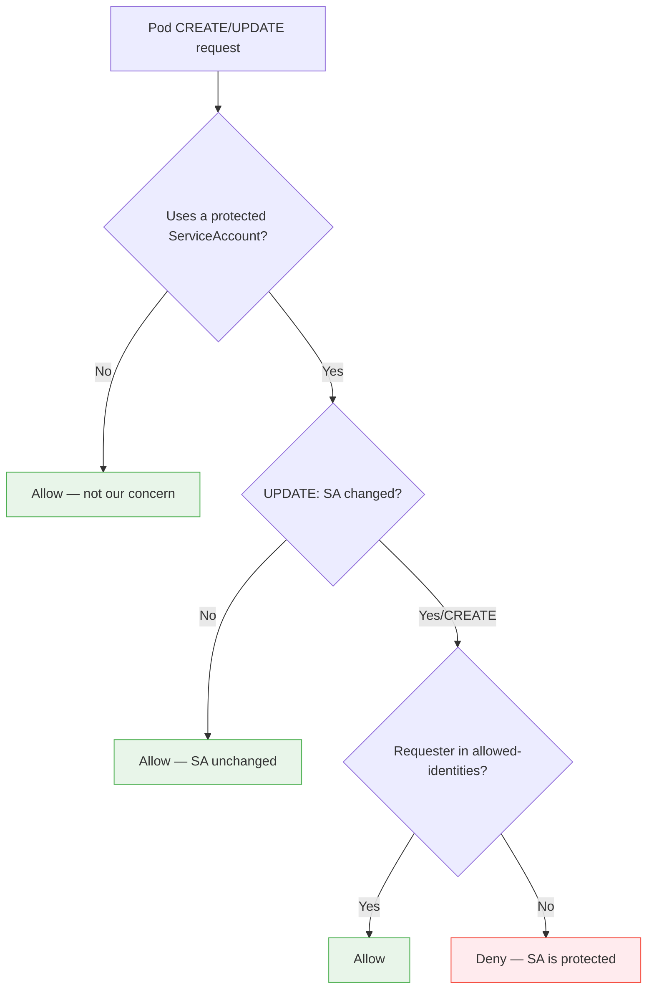

# SA Identity Protection

## Purpose

A ValidatingWebhook that prevents unauthorized use of an operator's ServiceAccount identity. It intercepts Pod `CREATE` and `UPDATE` requests and validates that only the operator's own workloads can use its ServiceAccount.

---

## Problem Addressed

Without SA protection, any user with `create pods` permission in the operator's namespace can create a pod that mounts the operator's ServiceAccount token. That pod then inherits the operator's full RBAC permissions. This is a privilege escalation path that bypasses RBAC restrictions on the user.

---

## Core Logic

The webhook enforces a simple decision flow:



```
Pod CREATE/UPDATE received
    |
    v
Is the pod using a protected ServiceAccount?
    |
    +-- No --> Allow
    +-- Yes --> Is the requesting user in the allowed-identities list?
                    |
                    +-- Yes --> Allow
                    +-- No --> Deny ("ServiceAccount is protected")
```

The allowed-identities list is configured at webhook registration time. It must include both:

- The operator's own controller ServiceAccount
- The Kubernetes system controllers that create Pods on the operator's behalf (e.g., `system:serviceaccount:kube-system:replicaset-controller` for Deployments, `system:serviceaccount:kube-system:job-controller` for Jobs)

The webhook matches the `userInfo.username` field from the admission request against this list.

The webhook uses namespace selectors to scope enforcement to the operator's namespace, avoiding cluster-wide webhook overhead.

---

## System Controller Tradeoff

Including system controllers (such as `replicaset-controller`, `job-controller`) in the allowed-identities list means any Deployment or Job in the operator's namespace can reference the protected SA. The webhook prevents direct Pod creation with the SA but does not prevent indirect creation via higher-level controllers.

**Compensating control:** restrict `create` on Deployments, StatefulSets, and Jobs in the operator's namespace to authorized principals only.

---

## Design Decisions

### Name-Only SA Matching

The webhook matches ServiceAccount names, not UIDs. This avoids the bootstrapping problem where the webhook needs to know the SA UID before the SA exists. Name-based matching is sufficient because SA names are unique within a namespace.

### Fail-Secure with Availability Tradeoff

If the webhook encounters an error evaluating a request, it denies the request (`failurePolicy: Fail`). This prevents attackers from exploiting webhook failures to bypass protection.

However, if the webhook pod is down, all pod creation in the scoped namespace is blocked. To mitigate this:

- Deploy the webhook in a separate namespace from the operator it protects.
- Use a PriorityClass to ensure scheduling priority.
- Configure PodDisruptionBudgets.

### Update Short-Circuit

Pod updates that do not change the ServiceAccount field are allowed without further validation. This avoids false positives from kubelet status updates and readiness probes.

---

## Limitations

### Ephemeral Containers

The `pods/ephemeralcontainers` subresource (used by `kubectl debug`) allows attaching a debug container to an existing pod. The debug container inherits the pod's ServiceAccount. This subresource does not trigger the SA protection webhook's Pod CREATE/UPDATE path.

**Mitigation:** restrict `pods/ephemeralcontainers` access in the operator's namespace via RBAC. A VAP template (`restrict-ephemeral-containers-on-protected-pods`) is provided to restrict who can create ephemeral containers on pods using protected ServiceAccounts.

### TokenRequest API

Any entity with `create` on `serviceaccounts/token` can mint new tokens for any SA, bypassing SA identity protection entirely. The RBAC audit component detects this exposure at startup.

**Mitigation:** the admin must restrict `serviceaccounts/token` access separately.
