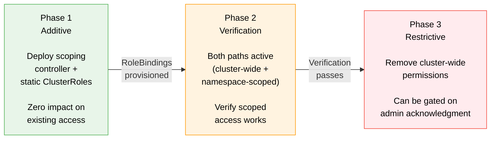

# Upgrade Safety

How the Operator RBAC Toolkit handles RBAC changes during operator upgrades without breaking existing deployments.

## The Problem: No Automatic RBAC Migration Exists

The Kubernetes ecosystem has no built-in mechanism for migrating RBAC permissions during operator upgrades. When an operator's ClusterRole changes between versions, the behavior depends entirely on the deployment method:

| Deployment Method | RBAC Update Behavior |
|-------------------|---------------------|
| OLM | Replaces ClusterRole contents on upgrade (atomic, no transition period) |
| Helm | Applies updated templates, may delete old resources depending on chart logic |
| GitOps (ArgoCD/Flux) | Syncs desired state, removes resources not in the new manifest |
| Manual `kubectl apply` | Additive only (new rules are added, old rules are never removed) |

None of these provide a safe, phased transition from broad permissions to scoped permissions. They either swap atomically (risking a window where the operator loses needed access) or never remove old permissions (leaving over-grants permanently).

The toolkit's additive-then-restrictive migration pattern fills this gap.

## 3-Phase Migration

The migration follows three distinct phases. Each phase is independently reversible, and each can be gated on verification before proceeding to the next.



### Phase 1: Additive (Zero Impact)

Deploy the scoping controller and static ClusterRoles. This creates new namespace-scoped RoleBindings alongside the existing ClusterRoleBinding.

What happens:

- Static ClusterRoles are applied (new resources, no conflict with existing)
- Scoping controller starts creating RoleBindings in target namespaces
- The existing ClusterRoleBinding remains active, unchanged
- The operator has both cluster-wide access (old path) and namespace-scoped access (new path)
- Functional behavior is identical to before the change

**Rollback**: Delete the scoping controller deployment and the static ClusterRoles. The RoleBindings created by the scoping controller are garbage-collected. The existing ClusterRoleBinding was never modified.

### Phase 2: Verification (Both Paths Active)

Verify that the namespace-scoped RoleBindings provide the access the operator actually needs. Both the old ClusterRoleBinding and the new RoleBindings are active simultaneously.

Verification steps:

```bash
# Confirm RoleBindings exist in target namespaces
kubectl get rolebindings -n <target-namespace> | grep <operator-name>

# Mint a token and verify scoped access
TOKEN=$(kubectl create token <sa-name> -n <operator-namespace>)

# Verify access in scoped namespace (should succeed)
kubectl auth can-i list secrets -n <target-namespace> --token=$TOKEN

# Verify no access in unrelated namespace (should fail with Forbidden)
kubectl auth can-i list secrets -n kube-system --token=$TOKEN
```

At this point, access in the target namespaces works through both the ClusterRoleBinding and the RoleBindings. The operator functions normally regardless of which path Kubernetes resolves.

**Rollback**: Same as Phase 1. Remove the scoping controller. The existing ClusterRoleBinding was never touched.

### Phase 3: Restrictive (Permission Removal)

Remove the cluster-wide permissions that are now redundant. This is the only phase that reduces existing access, and it can be gated on admin acknowledgment.

What changes:

- Remove namespace-scoped rules from the ClusterRole (rules for resources that are now covered by namespace-scoped RoleBindings)
- Optionally replace the ClusterRoleBinding with a RoleBinding in the operator's own namespace (for resources that only need same-namespace access)
- Remove unused rules identified by the audit (`pkg/audit`)

**Rollback**: Re-apply the original ClusterRole with the removed rules. The namespace-scoped RoleBindings remain active, so the operator has overlapping coverage during the rollback period.

## Mapping to Modularization Concepts

The 3-phase migration aligns with several concepts from modular operator architectures:

### Admin Acknowledgment Gates

Phase 3 (restrictive changes) can be gated on explicit admin acknowledgment. The scoping controller does not automatically remove the ClusterRoleBinding. The admin decides when to proceed based on verification results from Phase 2.

This matches the modularization principle that breaking changes require admin acknowledgment before taking effect. The operator never autonomously reduces its own permissions.

### Upgrade Gating

Before Phase 3 can proceed, a precondition check verifies that all required RoleBindings are provisioned:

```bash
# Check that all expected RoleBindings exist before removing the ClusterRoleBinding
for ns in $(kubectl get myplatformconfig -o jsonpath='{.items[*].spec.targetNamespace}'); do
  kubectl get rolebinding <binding-name> -n $ns || echo "MISSING: $ns"
done
```

If any RoleBindings are missing, the upgrade to Phase 3 is blocked. This prevents the scenario where an admin removes cluster-wide access before the scoped access is fully provisioned.

### Fix-Forward Philosophy

The migration is designed for fix-forward, not automated rollbacks:

- Each phase is manually reversible (the rollback steps are documented above)
- The system does not automatically revert to cluster-wide permissions if something fails
- Operators using `pkg/graceful` surface structured status conditions (`Degraded` with the specific missing permission) that tell the admin exactly what to fix
- Admin-driven debugging with clear error messages, rather than opaque automated recovery

## Addressing Ecosystem Warnings

### CNCF: Lax Permissions Trap

The [CNCF Operator White Paper](https://tag-app-delivery.cncf.io/whitepapers/operator/) warns:

> "It is common to start with lax permissions, and intentions to apply security concepts before release."

The additive phase (Phase 1) avoids this trap by design. The scoped permissions are deployed first, before the broad permissions are removed. There is never a point where the operator relies on "we'll tighten this later" because the tight permissions are already in place before the broad ones are removed.

### Kubernetes SIG-Auth: Wildcard Risks in Extensible Systems

The [Kubernetes RBAC Good Practices](https://kubernetes.io/docs/concepts/security/rbac-good-practices/) documentation warns against wildcard permissions in extensible systems:

> "Where possible, do not use wildcards to set permissions over all resources of a given type."

In a modular architecture, new CRD-based modules can be added after initial deployment. If an operator's ClusterRole uses wildcards (`resources: ["*"]`), every new CRD introduced by a module is automatically accessible. Namespace-scoped RoleBindings avoid this because they confine access to specific namespaces, regardless of what CRDs exist cluster-wide.

The migration's Phase 3 is the point where wildcards and overly broad resource lists are replaced with explicit, audited permission sets.

## Rollback Safety Summary

| Phase | Reversible | How | Data Loss Risk |
|-------|------------|-----|----------------|
| Phase 1 (additive) | Yes | Delete scoping controller + static ClusterRoles | None. Existing ClusterRoleBinding was never modified. |
| Phase 2 (verification) | Yes | Same as Phase 1 | None. Both access paths are active. |
| Phase 3 (restrictive) | Yes | Re-apply original ClusterRole rules | None. Namespace-scoped RoleBindings provide overlapping coverage during re-application. |

Each phase is independently reversible. A failure at any phase does not require reverting earlier phases. The worst case at any point is that the operator has both cluster-wide and namespace-scoped access simultaneously (redundant but safe).

## References

- [CNCF Operator White Paper](https://tag-app-delivery.cncf.io/whitepapers/operator/)
- [Kubernetes RBAC Good Practices](https://kubernetes.io/docs/concepts/security/rbac-good-practices/)
- [Architecture Overview](overview.md) (trust domain separation)
