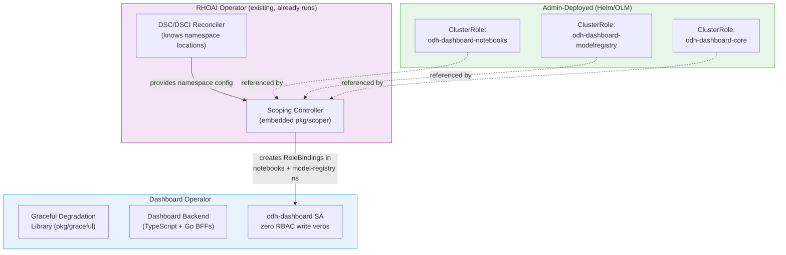

# Case Study: RHOAI Dashboard ClusterRole

This case study shows how the Operator RBAC Toolkit solves a real RBAC over-permissioning problem in the Red Hat OpenShift AI (RHOAI) Dashboard operator.

## The Problem

An audit of the RHOAI Dashboard's `odh-dashboard` ServiceAccount ClusterRole found that **only 2 out of 30 rules were correctly scoped**:

| Verdict | Count | Description |
|---------|-------|-------------|
| UNUSED (remove entirely) | 9 | Permissions for removed features, wrong resource types, or never-implemented API calls |
| USER-TOKEN-ONLY (remove) | 1.5 | Resources accessed via user-token passthrough, not the SA |
| OVER-PERMISSIONED (reduce verbs) | 14 | Rules granting `[get, list, watch, create, update, patch, delete]` when only `[list]` is needed |
| Correctly scoped | 2 | Only `namespaces/patch` and `auths/get` |
| REDUNDANT | 1 | Already covered by `system:auth-delegator` |

The `watch` verb was granted on nearly every resource but never used (the backend polls with `setInterval` + `list`, not the Kubernetes watch API).

### Blast Radius

With the ClusterRoleBinding, a compromised Dashboard SA token could list **43 secrets in kube-system** (cloud provider credentials, TLS certificates, database passwords) and access secrets in every other namespace.

### The Core Issue

The Dashboard needs cross-namespace access because the notebooks namespace and model registry namespace are configurable via DSC/DSCI. Developers used a ClusterRoleBinding as a shortcut for "access in multiple namespaces," granting cluster-wide access instead of scoping to the specific namespaces where access is needed.

## Solution Architecture

The toolkit solves this by splitting the responsibility:



The RHOAI operator already reconciles DSC/DSCI and knows where the notebooks and model registry namespaces are. Embedding `pkg/scoper` into it requires zero additional deployment. The Dashboard itself never touches RBAC.

## Step 1: Define the Static ClusterRoles

Based on the audit, the Dashboard's cross-namespace permissions split into three scoped ClusterRoles:

### Notebooks Namespace Permissions (Rule 7 subset)

The Jupyter Tile needs PVC, ConfigMap, and Secret access only in the notebooks namespace:

```yaml
apiVersion: rbac.authorization.k8s.io/v1
kind: ClusterRole
metadata:
  name: odh-dashboard-notebooks
rules:
  - apiGroups: [""]
    resources: ["persistentvolumeclaims"]
    verbs: ["create", "get"]
  - apiGroups: [""]
    resources: ["configmaps"]
    verbs: ["get", "create", "update"]
  - apiGroups: [""]
    resources: ["secrets"]
    verbs: ["get", "create", "update"]
```

### Model Registry Namespace Permissions (Rule 7 subset)

The Model Registry admin UI needs Secret access only in the model registry namespace:

```yaml
apiVersion: rbac.authorization.k8s.io/v1
kind: ClusterRole
metadata:
  name: odh-dashboard-modelregistry
rules:
  - apiGroups: [""]
    resources: ["secrets"]
    verbs: ["list", "delete", "patch"]
```

### Core Permissions (remaining rules, stay on ClusterRole)

Permissions for cluster-scoped resources (CSVs, DSCs, DSCIs, routes, consolelinks, etc.) remain on the existing ClusterRole since they inherently require cluster-wide access. These are tightened by removing unused verbs:

```yaml
# Keep on the existing ClusterRole (tightened):
# - clusterversions: [get] (was [get, watch, list])
# - subscriptions: [list] (was [get, list, watch])
# - consolelinks: [list] (was [get, list, watch])
# - datascienceclusters: [list] (was [list, watch, get])
# - dscinitializations: [list] (was [list, watch, get])
# - namespaces: [patch] (unchanged, correctly scoped)
# - auths: [get] (unchanged, correctly scoped)
# etc.
```

## Step 2: Configure the Scoping Controller

Embed `pkg/scoper` in the RHOAI operator. The RHOAI operator already reconciles `DataScienceCluster` (DSC) and knows the notebooks and model registry namespaces from the DSC spec.

```go
import "github.com/ugiordan/operator-rbac-toolkit/pkg/scoper"

func setupScoper(mgr ctrl.Manager) error {
    return scoper.Setup(mgr, scoper.Config{
        ControllerNamespace: "redhat-ods-operator",
        Targets: []scoper.ScopingTarget{
            {
                // When an OdhDashboardConfig CR exists, create a RoleBinding
                // in the notebooks namespace granting Dashboard SA access
                WatchGVK: schema.GroupVersionKind{
                    Group:   "opendatahub.io",
                    Version: "v1",
                    Kind:    "DataScienceCluster",
                },
                TargetSA: types.NamespacedName{
                    Name:      "odh-dashboard",
                    Namespace: "redhat-ods-applications",
                },
                ClusterRoleName:        "odh-dashboard-notebooks",
                ManagedRoleBindingName: "odh-dashboard-notebooks-binding",
                TargetNamespaceSource: &scoper.NamespaceSource{
                    FieldPath: ".spec.components.kueue.managementState",
                    // In practice, this would be the field path to the
                    // notebooks namespace in the DSC spec, e.g.:
                    // ".spec.notebookController.notebookNamespace"
                },
            },
            {
                // Same pattern for model registry namespace
                WatchGVK: schema.GroupVersionKind{
                    Group:   "opendatahub.io",
                    Version: "v1",
                    Kind:    "DataScienceCluster",
                },
                TargetSA: types.NamespacedName{
                    Name:      "odh-dashboard",
                    Namespace: "redhat-ods-applications",
                },
                ClusterRoleName:        "odh-dashboard-modelregistry",
                ManagedRoleBindingName: "odh-dashboard-modelregistry-binding",
                TargetNamespaceSource: &scoper.NamespaceSource{
                    FieldPath: ".spec.components.modelregistry.registriesNamespace",
                },
            },
        },
    })
}
```

When the DSC is reconciled, the scoping controller automatically creates:

- `odh-dashboard-notebooks-binding` RoleBinding in the notebooks namespace
- `odh-dashboard-modelregistry-binding` RoleBinding in the model registry namespace

Both reference their respective static ClusterRoles and bind to the `odh-dashboard` SA. When the DSC is deleted, the RoleBindings are garbage collected.

## Step 3: Add Graceful Degradation to Dashboard

The Dashboard backend (TypeScript + Go BFFs) can integrate the graceful degradation library to handle permission transitions cleanly. For the TypeScript backend, this means catching `Forbidden` responses and surfacing them via the Dashboard UI. For the Go BFFs, `pkg/graceful` wraps the client calls:

```go
import "github.com/ugiordan/operator-rbac-toolkit/pkg/graceful"

// In a Go BFF service that accesses secrets in the model registry namespace
handler := graceful.NewHandler(recorder)

func (s *ModelRegistryService) ListSecrets(ctx context.Context, namespace string) (*corev1.SecretList, error) {
    secrets := &corev1.SecretList{}
    result, err := handler.Do(ctx, s.Client, cr, func() error {
        return s.Client.List(ctx, secrets, client.InNamespace(namespace))
    })
    if err != nil {
        return nil, err
    }
    if result.RequeueAfter > 0 {
        // Permission not yet available (RoleBinding not created yet)
        // Return a structured error the frontend can display
        return nil, &PermissionPendingError{Namespace: namespace}
    }
    return secrets, nil
}
```

## Step 4: Migration

The migration is safe and reversible. Each step can be rolled back independently.

### 4.1 Deploy the Static ClusterRoles

```bash
kubectl apply -f odh-dashboard-notebooks-clusterrole.yaml
kubectl apply -f odh-dashboard-modelregistry-clusterrole.yaml
```

These are additive. They don't affect the existing ClusterRoleBinding.

### 4.2 Deploy the Scoping Controller

Update the RHOAI operator with the embedded `pkg/scoper` configuration. The scoping controller creates RoleBindings in the notebooks and model registry namespaces.

```bash
# Verify RoleBindings were created
kubectl get rolebindings -n rhods-notebooks | grep odh-dashboard
kubectl get rolebindings -n <modelregistry-ns> | grep odh-dashboard
```

### 4.3 Verify Access

Mint a token and verify scoped access works:

```bash
TOKEN=$(kubectl create token odh-dashboard -n redhat-ods-applications)

# Should succeed (RoleBinding exists in notebooks namespace)
kubectl get secrets -n rhods-notebooks --token=$TOKEN

# Should fail with Forbidden (no RoleBinding in kube-system)
kubectl get secrets -n kube-system --token=$TOKEN
```

### 4.4 Remove Scoped Permissions from ClusterRole

Remove rules 7 (configmaps, PVCs, secrets) and 16 (rolebindings, clusterrolebindings, roles) from the Dashboard's ClusterRole. These are now handled by the namespace-scoped RoleBindings.

Also remove the 9 completely unused rules identified in the audit.

### 4.5 Verify Blast Radius Reduction

```bash
TOKEN=$(kubectl create token odh-dashboard -n redhat-ods-applications)

# Before: 43 secrets accessible in kube-system
# After: Forbidden
kubectl get secrets -n kube-system --token=$TOKEN
# Error from server (Forbidden): secrets is forbidden

# Before: secrets accessible in every namespace
# After: only in namespaces with active RoleBindings
kubectl get secrets -A --token=$TOKEN
# Only returns secrets from rhods-notebooks and model-registry namespace
```

## Result

| Metric | Before | After |
|--------|--------|-------|
| ClusterRole rules | 30 | ~17 (removed 9 unused + 4 moved to scoped) |
| Namespaces with secret access | All (including kube-system) | 2 (notebooks + model-registry) |
| Secrets accessible in kube-system | 43 | 0 (Forbidden) |
| Total blast radius | Entire cluster | Confined to CR-bearing namespaces |
| Operator manages its own RBAC | No | No |
| Admin action required | None (existing RHOAI operator handles it) | None (embedded in RHOAI operator) |

The Dashboard continues to function identically. The only change is that a compromised SA token can no longer access resources outside the namespaces where access is actually needed.

## What Andrew Asked For

From the RHOAIENG-69306 proposal:

> "Super short need is new roles, owned by Platform/Auth resource, bound to Dashboard's SA"

This is exactly what the scoping controller does. The "Platform/Auth resource" is the RHOAI operator with embedded `pkg/scoper`. The namespace-scoped Roles (implemented as RoleBindings referencing static ClusterRoles) are created automatically based on the DSC configuration. The Dashboard doesn't manage its own RBAC. The cluster admin (via the RHOAI operator) owns the policy.
