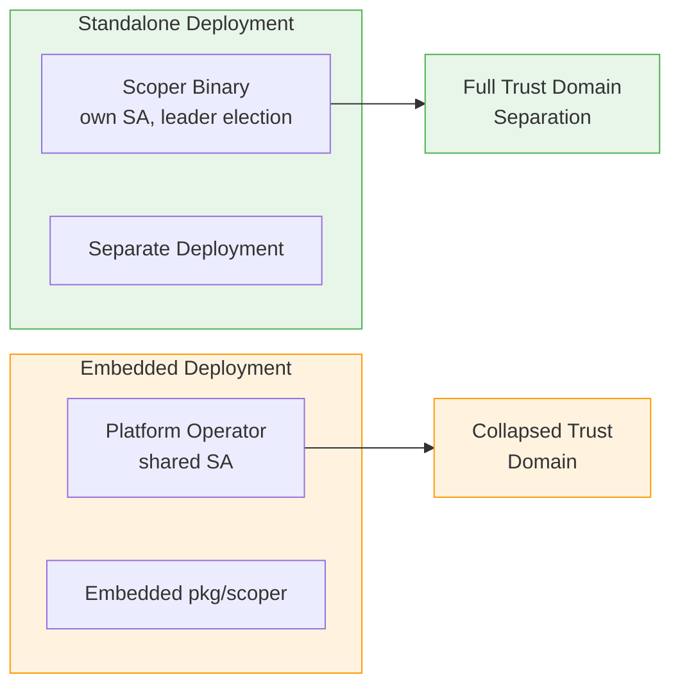

# Choose Your Deployment Model

The RBAC Scoping Controller can be deployed in two ways: as a standalone binary or as an embedded library. Both use the same `pkg/scoper` library. The difference is the deployment model and security posture.



## Two Options

### Standalone Binary (`cmd/scoper`)

Cluster admins deploy the scoping controller as a separate Deployment with its own ServiceAccount. The standalone binary reads configuration from a YAML file (typically mounted from a ConfigMap), starts the controller with leader election, and manages RoleBindings independently from the operators it scopes.

Recommended deployment: 2 replicas with leader election enabled.

### Embedded Library (`pkg/scoper`)

Platform operators import `pkg/scoper` and call `scoper.Setup()` in their existing operator's `main.go`. The scoping logic runs inside the platform operator's reconciliation loop. Zero additional deployment friction.

## Comparison

| Concern | Standalone Binary | Embedded Library |
|---------|------------------|-----------------|
| Deployment friction | Additional Deployment to install | Zero additional friction (code import) |
| Trust domain | Full separation (separate SA) | Collapsed (shared with platform operator's SA) |
| Upgrade path | Independent release cycle | Coupled to platform operator releases |
| HA | Leader election with 2 replicas | Inherits host operator's HA |
| Best for | Compliance-sensitive, multi-tenant, or untrusted operator environments | Clusters with an existing platform operator where it is already highly privileged |

## Security Considerations for Embedded Mode

When the scoping controller is embedded in a platform operator, it shares that operator's ServiceAccount. This collapses the trust domain separation.

```
+------------------------------------------+
|   Platform Operator Trust Domain          |
|   (combines admin and operator concerns)  |
|                                          |
|  - Platform SA (shared)                  |
|  - Scoping logic (bind verb)             |
|  - Application logic                     |
+------------------------------------------+
```

In this mode, compromising the platform operator SA grants the attacker both operator capabilities AND the `bind` verb for scoped ClusterRoles. The attacker can create RoleBindings in any namespace (bounded by namespace selector and VAPs).

**What is preserved in embedded mode:**

- VAP enforcement still holds (API-server-level, independent of SA compromise).
- The static ClusterRole ceiling still holds.
- The operator SA has no `escalate` verb, so it cannot create Roles with arbitrary rules.

**What is lost in embedded mode:**

- Trust domain separation. A single SA compromise grants both operator and RBAC management capabilities.
- The blast radius of a compromise is larger because the attacker gains access to both the operator's application-level permissions and the scoping controller's `bind` verb.

## Recommendation

Use the **standalone binary** when full trust domain separation is required. This is the recommended model for compliance-sensitive environments, multi-tenant clusters, or situations where the operators being scoped are not fully trusted.

Use the **embedded library** when the platform operator is already highly privileged (e.g., it already has cluster-admin-like permissions) and adding the scoping logic does not meaningfully increase its blast radius. In this case, the deployment simplicity outweighs the trust domain collapse.

## Next Steps

- For standalone binary deployment details, see the [Integration Guide](../integration/index.md).
- For embedded library setup with `scoper.Setup()`, see the [Integration Guide](../integration/index.md).
