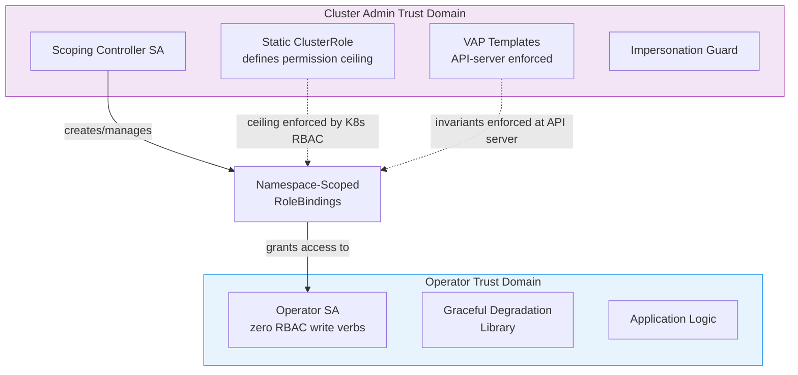

# Threat Model

This page documents the threat model for the Operator RBAC Toolkit. It covers assumptions, attack chain analysis, trust boundaries for both deployment modes, and blast radius quantification.

## Assumptions

The threat model is built on six core assumptions:

1. **Trusted API server.** The Kubernetes API server is trusted and correctly enforces RBAC.
2. **Node-level integrity assumed.** Container escapes to the node filesystem are out of scope. A compromised node can access all projected SA tokens for pods on that node, bypassing all API-level protections. Mitigation: use `automountServiceAccountToken: false` with explicit projected volumes using short-lived, audience-restricted bound tokens.
3. **Static ClusterRole deployed by admin.** The static ClusterRole does not use `aggregationRule` and is protected by the `protect-static-clusterrole` VAP.
4. **VAP templates deployed.** VAP templates are deployed by the admin and enforce invariants at the API server level.
5. **Standalone deployment has separate SA.** The scoping controller's ServiceAccount is separate from the operator's ServiceAccount. For embedded deployment, see [Trust Boundaries (Embedded Deployment)](#trust-boundaries-embedded-deployment).
6. **Migration from legacy ClusterRoleBindings is complete.** Legacy ClusterRoleBindings have been removed. Before migration is complete, the scoping controller provides additive RoleBindings but does not reduce existing cluster-wide access.

## Attack Chain Analysis

All residual risk assessments assume VAP integrity. See [Known Limitations: VAP Self-Protection](../design/tradeoffs.md) for VAP self-protection limitations.

| # | Attack Vector | Mitigated By | Residual Risk |
|---|---------------|-------------|---------------|
| 1 | Compromised operator SA token reads secrets in kube-system | Scoping controller (no RoleBinding in kube-system). Operator SA has no RBAC write verbs by design. | Bounded: requires scoping controller deployed AND legacy ClusterRoleBinding removed (assumption 6). Scoping controller availability and compromise risks per #8. |
| 2 | Attacker creates pod with operator's SA in operator namespace | SA protection webhook (denies unauthorized SA usage) | Webhook unavailability blocks all pod creation in scoped namespace. Deploy webhook in separate namespace with PriorityClass. |
| 3 | Namespace editor impersonates operator's SA | Impersonation guard (modifies component ClusterRole to remove impersonate verb) + deny-impersonate-grants VAP | Brief race window during guard startup or K8s upgrades. VAP prevents re-addition but does not help during initial startup when the verb already exists. |
| 4 | Compromised operator SA creates RoleBinding in kube-system | Operator SA has no RBAC write verbs by design (architectural prevention). VAPs provide defense-in-depth. | Mitigated by design. The operator SA cannot create RoleBindings. |
| 5 | Compromised operator SA modifies static ClusterRole to add rules | protect-static-clusterrole VAP + operator SA has no write verbs on ClusterRoles | Residual: VAP integrity. Does not cover aggregation-based injection (see #12). |
| 6 | Attacker modifies managed RoleBinding to change subject | restrict-scoped-rolebinding-subjects VAP + restrict-scoped-rolebinding-mutation VAP + scoping controller drift recovery | Residual: VAP integrity. |
| 7 | Attacker labels namespace to allow RoleBinding creation | protect-rbac-allowed-label VAP + protect-vap-enforcement-labels VAP | Admin compromise or VAP integrity compromise. |
| 8 | Scoping controller SA is compromised (standalone) | Controller SA only has bind on specific ClusterRoles (resourceNames). Cannot create arbitrary bindings. VAPs still enforce invariants. | Attacker can create RoleBindings in any namespace for the scoped ClusterRoles. Can forge annotation ownership to persist RoleBindings past cleanup. |
| 9 | TokenRequest API used to mint SA token | RBAC audit detects tokenrequest exposure at startup | Requires separate RBAC restriction on serviceaccounts/token. |
| 10 | Operator continues using existing broad ClusterRoleBinding | Migration guide, RBAC audit warns about ClusterRoleBindings | Requires admin action to remove legacy bindings. |
| 11 | Attacker sets CR field to target kube-system via TargetNamespaceSource | Controller-side deny-list (including openshift-* prefixes) + NamespaceSelector validation + deny-rolebinding-in-protected-namespaces VAP | Bounded: requires controller validation AND VAP. Deny-list must cover platform-specific namespaces. |
| 12 | Attacker injects rules into static ClusterRole via aggregation | Static ClusterRole MUST NOT use aggregationRule (validated at startup) + deny-aggregated-static-clusterrole VAP | Startup-only check. If ClusterRole is modified post-startup (protect-static-clusterrole VAP bypassed), aggregation may not be re-checked until restart. |
| 13 | Attacker uses kubectl debug to access operator SA token | restrict-ephemeral-containers-on-protected-pods VAP | Residual: VAP integrity. |
| 14 | Any user with CR create permission triggers RoleBinding creation | NamespaceSelector limits where RoleBindings are created. CRD-level RBAC restricts who can create watched CRs. | By design: CR creation triggers scoping. Restrict CRD create access to authorized users via standard RBAC. |
| 15 | Namespace label removed after RoleBinding creation | Scoping controller watches namespace label changes and revokes RoleBindings when namespace no longer matches NamespaceSelector | Brief window between label removal and next reconciliation cycle. |

## Trust Boundaries (Standalone Deployment)

In standalone deployment, the scoping controller runs as a separate Deployment with its own ServiceAccount. This creates two distinct trust domains.



```
+------------------------------------------+
|          Cluster Admin Trust Domain       |
|                                          |
|  - Static ClusterRole (defines ceiling)  |
|  - Scoping Controller SA                 |
|  - VAP Templates                         |
|  - Impersonation Guard                   |
+------------------------------------------+
          |
          | Creates/manages RoleBindings
          v
+------------------------------------------+
|          Operator Trust Domain            |
|                                          |
|  - Operator SA (RBAC consumer)           |
|  - Graceful Degradation Library          |
|  - Application logic                     |
+------------------------------------------+
```

A compromise in the operator trust domain cannot escalate into the admin trust domain because:

- The operator SA has no RBAC write verbs.
- The operator SA cannot modify the static ClusterRole (VAP enforced).
- The operator SA cannot create or delete RoleBindings (VAP enforced).
- The operator SA cannot modify the scoping controller's SA permissions.

## Trust Boundaries (Embedded Deployment)

When the scoping controller is embedded in a platform operator, the trust boundary is collapsed:

```
+------------------------------------------+
|   Platform Operator Trust Domain          |
|   (combines admin and operator concerns)  |
|                                          |
|  - Platform SA (shared)                  |
|  - Scoping logic (bind verb)             |
|  - Application logic                     |
+------------------------------------------+
```

In this mode, compromising the platform operator SA grants the attacker both operator capabilities AND the `bind` verb for scoped ClusterRoles. The attacker can create RoleBindings in any namespace (bounded by namespace selector and VAPs).

### What is preserved in embedded mode

- VAP enforcement still holds (API-server-level, independent of SA compromise).
- The static ClusterRole ceiling still holds.
- The operator SA has no `escalate` verb, so it cannot create Roles with arbitrary rules.

### What is lost in embedded mode

- Trust domain separation. A single SA compromise grants both operator and RBAC management capabilities.
- Attack chain #8 applies to the combined SA, increasing the blast radius of a compromise.

### When to use each mode

Use **embedded mode** when the platform operator is already highly privileged (e.g., RHOAI operator with cluster-admin-like permissions) and adding the scoping logic does not meaningfully increase its blast radius.

Use **standalone mode** for operators where trust domain separation is a compliance requirement.

## Blast Radius Quantification

### Measurement methodology

1. Mint a token for the operator's SA using `kubectl create token <sa-name> -n <namespace>`.
2. Attempt to list secrets in every namespace using `kubectl get secrets --all-namespaces --token=<token>`.
3. Count the namespaces where the request succeeds and the total secrets accessible.

### Example measurement (RHOAI Dashboard)

| Scenario | Namespaces with secret access | Total secrets accessible |
|----------|-------------------------------|------------------------|
| ClusterRoleBinding (before) | All namespaces (including kube-system) | 43 in kube-system + all others |
| Namespace-scoped RoleBindings (after) | Only namespaces with active CRs | 5 in the CR namespace |

The reduction is not a percentage (which varies by cluster size) but an absolute confinement: access exists only where CRs exist. Kubernetes evaluates RBAC against current bindings on every API request, so removing the ClusterRoleBinding and adding namespace-scoped RoleBindings takes effect immediately for all existing tokens. No token rotation is required.
